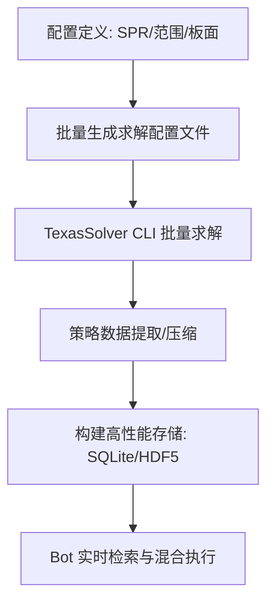

# 离线 GTO 计算流水线方案 (Offline GTO Pipeline)

为了实现真正的 GTO 决策，我们需要将计算前移。本方案旨在构建一套自动化的工程链路，将复杂的博弈论求解结论转化为 Bot 可秒级检索的“决策字典”。

## 1. 核心流程 (Core Workflow)



## 2. 关键组件 (Key Components)

### 2.1 局面空间采样 (State Sampling)
由于德州扑克的局面近乎无限，我们需要对空间进行科学采样：
*   **板面归位 (Board Grouping)**：将相似的板面（如不同的花色但同样的点数结构）归类为同一种。
*   **筹码深度采样**：重点计算 SPR 为 1, 3, 8, 15, 25 的标准局面。
*   **范围固定**：使用标准的 6-Max GTO 开池与防御范围。

### 2.2 求解器自动化 (Solver Automation)
使用 `TexasSolver` 的命令行接口进行大规模计算：
```bash
# 示例：自动化脚本生成的求解指令
./TexasSolverConsole --config configs/flop_A_high_dry.json --output results/
```

### 2.3 决策字典数据结构 (Lookup Table)
我们需要一种极快的数据结构来存储策略。建议采用如下 KV 结构：
*   **Key**: `Hash(Pos + Board + ActionHistory)`
*   **Value**: `{ Hand: [Fold_Prob, Call_Prob, Raise_Prob], ... }`

## 3. 存储与检索方案

### 建议存储：SQLite (索引优化)
| 局面 Hash (Index) | 手牌编码 | 放弃 % | 跟注 % | 加注 % | 建议尺度 |
| :--- | :--- | :--- | :--- | :--- | :--- |
| `0x7a2b...` | `AA` | 0.00 | 0.20 | 0.80 | 33% Pot |
| `0x7a2b...` | `7(c)2(h)` | 1.00 | 0.00 | 0.00 | 0 |

## 4. 后续里程碑
1.  [ ] **工具准备**：集成 `TexasSolver` 的 Python 包装器。
2.  [ ] **样板计算**：先针对翻牌前 (Preflop) 的 3-Bet 局面跑通全流程。
3.  [ ] **数据注入**：更新 `BalancedBrain` 在匹配到 Hash 时优先读取字典。

---

> [!IMPORTANT]
> 离线流水线的难点不在于算法，而在于**存储容量与检索效率**。全量的 6-Max GTO 库可能达到数百 GB，我们将采用“特征压缩”技术将其控制在 2-5GB 以内。
